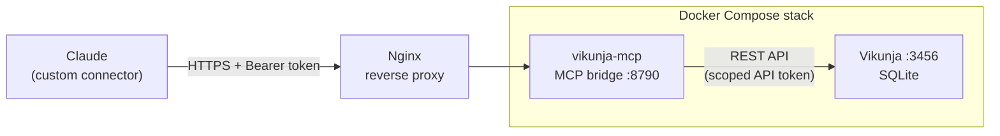

# Vikunja MCP Server

A self-hosted [Model Context Protocol (MCP)](https://modelcontextprotocol.io) server that connects AI assistants like **Claude** to a self-hosted **[Vikunja](https://vikunja.io)** task tracker. It ships as a single Docker Compose stack: Vikunja itself plus the MCP bridge.

I built it when my team outgrew Linear's free plan and moved to a self-hosted tracker, so Claude could keep reading, creating, updating and organizing tickets. It runs in production on my own Proxmox infrastructure and is used daily.

**Stack:** Node.js 22 · MCP (streamable HTTP, JSON-RPC 2.0) · Vikunja 2.6 · Docker Compose · Portainer · Nginx reverse proxy

## Architecture



- **`vikunja`**: the Vikunja app (SQLite database and file uploads on named volumes)
- **`vikunja-mcp`**: the MCP bridge, built from `./mcp`, with a single dependency (`marked`)
- **`vikunja-init`**: a one-shot container that fixes volume ownership so Vikunja (uid 1000) can write to Docker's root-owned volumes. It exits with code 0 by design.

## Tools

The bridge exposes 20 tools:

| Area | Tools |
|---|---|
| Projects | `list_projects` |
| Tasks | `list_tasks`, `search_tasks`, `get_task`, `create_task`, `update_task` |
| Descriptions | `get_description`, `edit_description` (exact find-and-replace done server-side) |
| Kanban board | `list_buckets`, `list_bucket_tasks`, `move_task` |
| Comments | `add_comment` |
| Labels | `list_labels`, `set_labels` (creates missing labels, case-insensitive matching) |
| Relations | `relate_tasks`, `list_relations` (subtask, parent, blocking, related, and more) |
| Attachments | `attach_from_url`, `add_attachment`, `list_attachments` |
| Diagnostics | `check_api` (self-test that reports which Vikunja endpoint is failing) |

## Design decisions

Letting an AI write to a production tracker needs guardrails. The main ones:

- **Least-privilege API token.** The bridge is designed around a Vikunja token with no delete permissions on anything. Deleting stays a human action in the UI.
- **Humans close tickets.** With `MCP_BLOCK_DONE=true`, `move_task` refuses to move anything into the Done column.
- **Safe to re-run.** `create_task` skips duplicates by imported ticket key (or by full title with `unique_title`), and `attach_from_url` skips a file with the same name and size. A batch interrupted by a dropped connection can simply be run again.
- **Token-efficient responses.** Write operations return a short acknowledgement instead of echoing the full description back, which cut the cost of each write roughly in half on large tickets. Listings preview descriptions and flag truncation explicitly, so a client never edits text it can only partly see.
- **Markdown in, HTML stored.** Vikunja stores descriptions as HTML, so markdown from the client is converted with `marked` (tables, nested lists and code blocks survive).
- **Binary data stays out of the conversation.** `attach_from_url` has the server download the file itself, so images never pass through the model as base64.
- **Hardened auth.** Bearer tokens are compared in constant time, against every configured principal, so the work done does not reveal which token was presented. `GET /mcp` returns `405` (not `404`) as the MCP spec requires, so clients detect the endpoint correctly.
- **One bridge, several people.** Each caller's bearer token maps to their own Vikunja API token, so everyone acts as themselves: their own permissions, their own name in the audit trail, and revocation by deleting a single entry. Sharing one token instead would make every action look like the owner's.
- **Debuggable.** One log line per request: method, path, status, whether an auth header was present, which principal it resolved to, and the JSON-RPC method.

## Deploy

### 1. Configure environment variables

| Variable | Purpose |
|---|---|
| `VIKUNJA_DOMAIN` | Public hostname for Vikunja, e.g. `tasks.example.com` |
| `VIKUNJA_JWT_SECRET` | Long random secret for Vikunja sessions |
| `VIKUNJA_PORT` | Host port for Vikunja |
| `VIKUNJA_API_TOKEN` | Vikunja API token the bridge uses (create it in Vikunja → Settings → API Tokens) |
| `MCP_AUTH_TOKEN` | Bearer token clients must send to the bridge |
| `MCP_PRINCIPALS` | *(optional)* Additional users, each with their own Vikunja identity — see [Multiple users](#multiple-users) |
| `MCP_PORT_HOST` | Host port for the bridge |
| `TZ` | Timezone, e.g. `America/Chicago` |

> **Tip:** use hex-only secrets (for example `openssl rand -hex 32`). Docker Compose interprets `$` in values, which silently changes the token inside the container.

**API token permissions:** grant read and write on Projects, Projects Views, Tasks, Task Comments, Task Attachments, Task Labels, Task Relations and Labels. Leave every **Delete** permission unchecked.

### 2. Start the stack

With Docker Compose:

```bash
docker compose up -d --build
```

Or in **Portainer**: Stacks → Add stack → **Repository**, point it at this repo, add the environment variables, and deploy. Use **Pull and redeploy** after changes, since the bridge is built from source.

Registration is disabled by default (`VIKUNJA_SERVICE_ENABLEREGISTRATION=false`).

### 3. Put it behind a reverse proxy

Expose Vikunja and the bridge over HTTPS (Nginx, Nginx Proxy Manager, Caddy or Traefik), for example `tasks.example.com` → Vikunja and `mcp.example.com` → the bridge.

### 4. Verify

```bash
curl https://mcp.example.com/healthz          # 200 {"ok":true}
curl -i https://mcp.example.com/mcp           # 405, Allow: POST, OPTIONS
curl -i -X POST https://mcp.example.com/mcp   # 401 without a token
```

### 5. Connect Claude

In Claude, add a **custom connector**:

- **URL:** `https://mcp.example.com/mcp`
- **Authentication:** none (no OAuth)
- **Request header:** `authorization` = `Bearer <MCP_AUTH_TOKEN>`

Then ask Claude to run `check_api`. After adding new tools to the server, start a new chat so the client loads the updated tool list.

## Multiple users

One bridge can serve several people, each acting as themselves in Vikunja instead of sharing a single identity. The Vikunja API token lives in the bridge's environment rather than in the client, so a second person pointed at the same connector would otherwise act as the first. `MCP_PRINCIPALS` fixes that without a second container or subdomain:

```
MCP_PRINCIPALS="alice:<her mcp token>:<her vikunja token>; bob:<his mcp token>:<his vikunja token>"
```

Semicolons separate people, colons separate the three fields. `MCP_AUTH_TOKEN` and `VIKUNJA_TOKEN` stay as the `owner` principal, so an existing deployment keeps working untouched.

Everyone gets their own Vikunja account and their own scoped API token, so permissions are genuinely per-user and the audit trail is honest. Removing someone means deleting their entry and redeploying, with no effect on anyone else. `check_api` reports which principal a call resolved to, and every log line carries `as=<name>`.

## Bridge configuration

| Variable | Default | Purpose |
|---|---|---|
| `VIKUNJA_URL` | `http://vikunja:3456` | Vikunja address inside the Docker network |
| `VIKUNJA_TOKEN` | *(required)* | API token (set from `VIKUNJA_API_TOKEN` in the compose file) |
| `MCP_AUTH_TOKEN` | *(required)* | Bearer token for clients (the `owner` principal) |
| `MCP_PRINCIPALS` | *(empty)* | Extra principals, as `name:mcpToken:vikunjaToken` separated by `;` |
| `MCP_PORT` | `8790` | Port the bridge listens on |
| `MCP_BLOCK_DONE` | `true` | Refuse moves into the Done column |
| `MCP_DONE_BUCKET_TITLE` | `Done` | Name of the column treated as Done |

## Troubleshooting

Check the bridge logs first (`docker logs <vikunja-mcp container>` or Portainer → Containers → Logs).

| Log line | Meaning |
|---|---|
| `401 auth=present` | The client's token doesn't match `MCP_AUTH_TOKEN`. Claude may report this as "Couldn't reach" the server. |
| `401 auth=absent` | No auth header arrived. Check the connector header or whether the proxy strips it. |
| Nothing logged | The request never reached the bridge. Check DNS and the reverse proxy. |
| Buckets return 401, tasks work | The API token is missing the **Projects Views** permission. |

## Author

Built by **Eden Kogan**. I design and run self-hosted infrastructure: Proxmox, Linux, Docker, and AI integrations.
